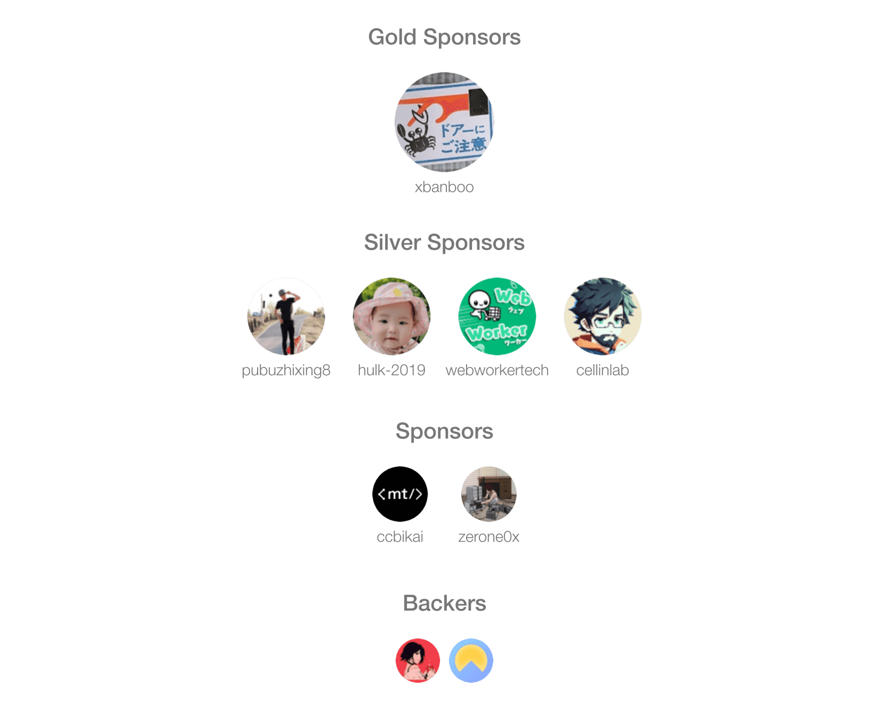

<div align="center">

[;小孙同学祝您今天愉快!&center=true&size=27)](https://git.io/typing-svg)

<picture>
  <source media="(prefers-color-scheme: dark)" srcset="https://cdn.jsdelivr.net/gh/sun0225SUN/sun0225SUN/assets/images/coding.gif" />
  <source media="(prefers-color-scheme: light)" srcset="https://cdn.jsdelivr.net/gh/sun0225SUN/sun0225SUN/assets/images/developer.svg" height="225px" />
  
</picture>

<div>&nbsp;</div>

<div>
  <a href="https://x.com/sun0225SUN"></a>&emsp;
  <a href="https://www.youtube.com/@sun0225SUN"></a>&emsp;
  <a href="https://blog.guoqi.dev/"></a>&emsp;
  <a href="https://mp.guoqi.dev"></a>&emsp;
  <a href="https://space.bilibili.com/448488855/"></a>&emsp;
  <!-- visitor -->
  &emsp;
  <!-- wakatime -->
  <a href="https://wakatime.com/@sun0225SUN"></a>
</div>

<picture>
  <source media="(prefers-color-scheme: dark)" srcset="https://cdn.jsdelivr.net/gh/sun0225SUN/sun0225SUN/profile-snake-contrib/github-contribution-grid-snake-dark.svg" />
  <source media="(prefers-color-scheme: light)" srcset="https://cdn.jsdelivr.net/gh/sun0225SUN/sun0225SUN/profile-snake-contrib/github-contribution-grid-snake.svg" />
  
</picture>



<div align="center">
<a href="https://www.buymeacoffee.com/guoqisun" target="_blank">
  
</a>

<table style="margin-top: 20px;">
  <tbody>
    <tr>
      <td align="center">
        
      </td>
      <td align="center">
        
      </td>
    </tr>
  </tbody>
</table>
</div>
</div>


#  🙋 Hello

<table>

<tr><td>

### 🤺 About Me


<p>&emsp;&emsp;嗨，你好，我是小孙同学。热爱编程、摄影、读书、旅行。</p>
<p>&emsp;&emsp;热爱计算机科学和 IT 互联网事业，希望能成为一名优秀的开发者。</p>
<p>&emsp;&emsp;我们正在让这个世界变得更加美好，通过代码的重复使用和延展构建完美体系。</p>
<p>&emsp;&emsp;<strong>We're making the world a better place. Through constructing elegant hierarchies for maximum code reuse and extensibility.</strong></p>

</tr></td>

<tr><td>

### 📃 Recent Blog


<!-- feed start -->
- Mar 18 - [昆仑巢「疯狂星期六」，没有人是一座孤岛～](https://blog.guoqi.dev/posts/kun-lun-chao/)
- Mar 10 - [你好，北京！你好，原则科技！](https://blog.guoqi.dev/posts/yuan-ze-ke-ji/)
- Feb 20 - [行则将至，未来可期，和 2023 好好说声再见吧！](https://blog.guoqi.dev/posts/2023/)
- Feb 16 - [西藏之旅｜青春没有售价，火车直达拉萨！](https://blog.guoqi.dev/posts/xi-zang/)
- Jan 03 - [珠海之旅｜去感受风，去聆听海，去触摸，去抵达](https://blog.guoqi.dev/posts/zhu-hai/)
<!-- feed end -->

</td></tr>

<!-- <tr><td>

### 📊 WakaTime

<picture>
  <source
    srcset="https://github-readme-stats.vercel.app/api/wakatime?username=sun0225SUN&layout=compact&text_color=f0f6fc&bg_color=00000000&hide_border=true&hide_title=true"
    media="(prefers-color-scheme: dark)"
  />
  <source
    srcset="https://github-readme-stats.vercel.app/api/wakatime?username=sun0225SUN&layout=compact&text_color=1f2328&bg_color=00000000&hide_border=true&hide_title=true"
    media="(prefers-color-scheme: light)"
  />
  
</picture>

</td></tr> -->

<tr><td>

### 📊 WakaTime

<!--START_SECTION:waka-->
**I'm an Early 🐤** 

```text
🌞 Morning                753 commits         ██████░░░░░░░░░░░░░░░░░░░   25.03 % 
🌆 Daytime                915 commits         ████████░░░░░░░░░░░░░░░░░   30.42 % 
🌃 Evening                686 commits         ██████░░░░░░░░░░░░░░░░░░░   22.81 % 
🌙 Night                  654 commits         █████░░░░░░░░░░░░░░░░░░░░   21.74 % 
```
📅 **I'm Most Productive on Friday** 

```text
Monday                   403 commits         ███░░░░░░░░░░░░░░░░░░░░░░   13.40 % 
Tuesday                  305 commits         ███░░░░░░░░░░░░░░░░░░░░░░   10.14 % 
Wednesday                428 commits         ████░░░░░░░░░░░░░░░░░░░░░   14.23 % 
Thursday                 397 commits         ███░░░░░░░░░░░░░░░░░░░░░░   13.20 % 
Friday                   703 commits         ██████░░░░░░░░░░░░░░░░░░░   23.37 % 
Saturday                 281 commits         ██░░░░░░░░░░░░░░░░░░░░░░░   09.34 % 
Sunday                   491 commits         ████░░░░░░░░░░░░░░░░░░░░░   16.32 % 
```


📊 **This Week I Spent My Time On** 

```text
🕑︎ Time Zone: Asia/Shanghai

💬 Programming Languages: 
TypeScript               14 hrs 3 mins       ██████████████████░░░░░░░   72.63 % 
MDX                      1 hr 41 mins        ██░░░░░░░░░░░░░░░░░░░░░░░   08.78 % 
JSON                     1 hr 29 mins        ██░░░░░░░░░░░░░░░░░░░░░░░   07.74 % 
Bash                     42 mins             █░░░░░░░░░░░░░░░░░░░░░░░░   03.66 % 
CSS                      30 mins             █░░░░░░░░░░░░░░░░░░░░░░░░   02.63 % 

🔥 Editors: 
Cursor                   19 hrs 21 mins      █████████████████████████   100.00 % 

💻 Operating System: 
Mac                      19 hrs 21 mins      █████████████████████████   100.00 % 
```


 Last Updated on 24/12/2025 00:46:37 UTC
<!--END_SECTION:waka-->

</td></tr>

</table>


<div align="center">


<div>
  <picture>
    <source media="(prefers-color-scheme: dark)" srcset="https://readme-jokes.vercel.app/api?hideBorder&bgColor=%23121212" />
    <source media="(prefers-color-scheme: light)" srcset="https://readme-jokes.vercel.app/api?hideBorder&bgColor=%ffffff" />
    
  </picture>
</div>


<picture>
  <source media="(prefers-color-scheme: dark)" srcset="https://github-readme-streak-stats.herokuapp.com/?user=sun0225SUN&theme=dark&hide_border=true" />
  <source media="(prefers-color-scheme: light)" srcset="https://github-readme-streak-stats.herokuapp.com/?user=sun0225SUN&theme=light&hide_border=true" />
  
</picture>


<table>
  <tr>
    <td>
      <picture>
        <source media="(prefers-color-scheme: dark)" srcset="https://github-readme-activity-graph.vercel.app/graph?username=sun0225SUN&theme=xcode&bg_color=FF000000&hide_border=true" />
        <source media="(prefers-color-scheme: light)" srcset="https://github-readme-activity-graph.vercel.app/graph?username=sun0225SUN&theme=xcode&bg_color=FF000000&color=000000&hide_border=true" />
        
      </picture>
  </tr>
</table>

</div>


<div align="center" >


<div><br/></div>

<!-- <div><br/></div> -->

<table>
  <tr>
    <td></td>
    <td></td>
  </tr>
</table>

</div>


<div align="center" >


<br>

<!-- svg -->


 


<br>

<!-- gif -->


<picture>
  <source media="(prefers-color-scheme: dark)" srcset="https://cdn.jsdelivr.net/gh/sun0225SUN/sun0225SUN/profile-3d-contrib/profile-night-rainbow.svg" />
  <source media="(prefers-color-scheme: light)" srcset="https://cdn.jsdelivr.net/gh/sun0225SUN/sun0225SUN/profile-3d-contrib/profile-gitblock.svg" />
  
</picture>

</div>


<div align="center">


<table>
  <tr>
    <td></td>
  </tr>
</table>

<table>
  <tr>
    <td></td>
    <td></td>
  </tr>
  <tr>
    <td></td>
    <td></td>
  </tr>
  <tr>
    <td></td>
    <td></td>
  </tr>
  <tr>
    <td></td>
    <td></td>
  </tr>
  <tr>
    <td></td>
    <td></td>
  </tr>
</table>


</div>

</div>
