<div align="center">
  
  <!-- dynamic typing effect 动态打字效果 -->
  <div align="center">
    <a href="https://blog.sunguoqi.com/">
      
    </a>
  </div>

  <!-- knock code pictures 敲代码的图片 -->
  <br>

  <!-- profile logo 个人资料徽标 -->
  <div align="center"
    <a href="https://space.bilibili.com/395592943/">
    <!-- visitor statistics logo 访问量统计徽标 -->
    
  </div>

<!-- Snake Code Contribution Map 贪吃蛇代码贡献图 -->
<picture>
  <source media="(prefers-color-scheme: dark)" srcset="https://cdn.jsdelivr.net/gh/MCQA2580/MCQA2580/profile-snake-contrib/github-contribution-grid-snake-dark.svg" />
  <source media="(prefers-color-scheme: light)" srcset="https://cdn.jsdelivr.net/gh/MCQA2580/MCQA2580/profile-snake-contrib/github-contribution-grid-snake.svg" />
  
</picture>

</div>

#  🙋 Hello

<table>
<tr><td>

<!-- About me 关于我 -->
### 🤺 About Me


<p>&emsp;&emsp;大家好，我是小陌同学。</p>
<p>&emsp;&emsp;热爱编程、摄影、读书、旅行。</p>
<p>&emsp;&emsp;热爱计算机科学和IT互联网事业，励志成为一名优秀的开发者。</p>
<p>&emsp;&emsp;我们正在让这个世界变得更加美好，通过代码的重复使用和延展构建完美体系。</p>
<p><strong>&emsp;&emsp;We're making the world a better place. Through constructing elegant hierarchies for maximum code reuse and extensibility.</strong></p>


### 🧠 Second Brain


<!-- START_SECTION:brain -->
* <a href='https://brain.sunguoqi.com/web/frontend/css/css-in-depth/test.html' target='_blank'>My Note</a> - 2023-09-07
* <a href='https://brain.sunguoqi.com/web/frontend/css/css-world/test.html' target='_blank'>My Note</a> - 2023-09-07
* <a href='https://brain.sunguoqi.com/web/frontend/js/my-notes/test.html' target='_blank'>My Note</a> - 2023-09-07
* <a href='https://brain.sunguoqi.com/web/frontend/js/professional-javascript/ch1.html' target='_blank'>JavaScript 简介</a> - 2023-08-20
* <a href='https://brain.sunguoqi.com/web/frontend/js/professional-javascript/ch10.html' target='_blank'>模块</a> - 2023-08-20
<!-- END_SECTION:brain -->

</td></tr>

<tr><td>

### 🤾‍♂️ Funny Soul


<!-- START_SECTION:douban -->
* <a href='https://book.douban.com/subject/35193035/' target='_blank'>最近在读认知觉醒</a> 🌟🌟🌟🌟🌟 力荐- 2023-04-17
* <a href='http://movie.douban.com/subject/1292052/' target='_blank'>看过肖申克的救赎</a> 🌟🌟🌟🌟🌟 力荐- 2023-02-07
* <a href='http://movie.douban.com/subject/1292365/' target='_blank'>看过活着</a> 🌟🌟🌟🌟🌟 力荐- 2023-02-07
* <a href='https://music.douban.com/subject/26567580/' target='_blank'>听过假如爱有天意</a> 🌟🌟🌟🌟🌟 力荐- 2023-02-07
* <a href='http://movie.douban.com/subject/35465232/' target='_blank'>在看狂飙</a> 🌟🌟🌟🌟🌟 力荐- 2023-02-07
<!-- END_SECTION:douban -->

</td></tr>

<tr><td>
</td></tr>

<tr><td>

<!--START_SECTION:waka-->
**I'm an Early 🐤** 

```text
🌞 Morning                390 commits         ██████░░░░░░░░░░░░░░░░░░░   22.17 % 
🌆 Daytime                547 commits         ████████░░░░░░░░░░░░░░░░░   31.10 % 
🌃 Evening                550 commits         ████████░░░░░░░░░░░░░░░░░   31.27 % 
🌙 Night                  272 commits         ████░░░░░░░░░░░░░░░░░░░░░   15.46 % 
```
📅 **I'm Most Productive on Friday** 

```text
Monday                   228 commits         ███░░░░░░░░░░░░░░░░░░░░░░   12.96 % 
Tuesday                  195 commits         ███░░░░░░░░░░░░░░░░░░░░░░   11.09 % 
Wednesday                228 commits         ███░░░░░░░░░░░░░░░░░░░░░░   12.96 % 
Thursday                 211 commits         ███░░░░░░░░░░░░░░░░░░░░░░   12.00 % 
Friday                   487 commits         ███████░░░░░░░░░░░░░░░░░░   27.69 % 
Saturday                 163 commits         ██░░░░░░░░░░░░░░░░░░░░░░░   09.27 % 
Sunday                   247 commits         ████░░░░░░░░░░░░░░░░░░░░░   14.04 % 
```


📊 **This Week I Spent My Time On** 

```text
🕑︎ Time Zone: Asia/Shanghai

💬 Programming Languages: 
Vue.js                   9 hrs 27 mins       ███████████████████████░░   90.44 % 
JavaScript               52 mins             ██░░░░░░░░░░░░░░░░░░░░░░░   08.39 % 
Ezhil                    4 mins              ░░░░░░░░░░░░░░░░░░░░░░░░░   00.68 % 
SCSS                     1 min               ░░░░░░░░░░░░░░░░░░░░░░░░░   00.28 % 
JSON                     1 min               ░░░░░░░░░░░░░░░░░░░░░░░░░   00.19 % 

🔥 Editors: 
VS Code                  10 hrs 27 mins      █████████████████████████   100.00 % 

💻 Operating System: 
Windows                  10 hrs 27 mins      █████████████████████████   100.00 % 
```


 Last Updated on 28/09/2023 01:12:21 UTC
<!--END_SECTION:waka-->
  
</td></tr>
</table>

<!-- ########################################## 分割 ########################################## -->


<div align="center" >



<!-- just img 图片 -->


<!--  skill badge 技能徽章 -->

```mermaid
mindmap
  root((小陌同学))
    编程
      Web开发
      网络爬虫
      人工智能
    摄影
      风光
    旅行
      广州
      苏州
      南京
      滁州
      合肥
      寿县
    阅读
      人物传记
      个人成长
      社会文化
      计算机技术
```

💪 正在学习


  
🧠 计划学习


🧰 常用的工具


<!-- programming tool icon 编程工具图标 -->
<br>

<!-- svg -->


 


<br>

<!-- gif -->


<!-- just img 图片 -->
</div>

<!-- profile-3d-contrib 3D贡献图-->

</div>

<!-- ########################################## 分割 ########################################## -->


<div align="center" >

<!-- Github-Stats-Terminal 终端风格信息 -->
<br>
  
<!-- Quotes 名人名言 -->
<br>
  
<!-- GitHub 奖杯🏆 -->
<br>

<!-- GitHub 数据统计 -->

<br><br>

<!-- Awesome repo 比较好的仓库-->
<a href="https://github.com/MCQA2580/Awesome-Love-Code">
</a>
<a href="https://github.com/MCQA2580/Student-Data-Vision">
</a><br><br>
  
<!-- Wakatime Graph-->
<table>
  <tr>
    <td></td>
    <td></td>
  </tr>
  <tr>
    <td colspan="2"><a href="https://run.sunguoqi.com"></a><br></td>
  </tr>
</table>
</div>

<!-- ########################################## 分割 ########################################## -->


<div align="center">

<!-- run 图片 -->


<!-- Joke 笑话 -->
<div></div>

<!-- github-readme-streak-stats 连续提交代码天数记录 -->
&emsp;

&emsp;

<!-- metrics 基础资料 -->
&emsp;

&emsp;

<!-- GitHub Activity Graph GitHub 活动图 -->
<table align="center">
  <tr>
    <td></td>
  </tr>
</table>

</div>

<!-- ########################################## 分割 ########################################## -->


<!-- GitHub metrics 信息指标 -->
<div align="center">

<!-- just img 图片 -->


<!-- first form 第一个表格 -->
<table>
  <tr>
    <td></td>
  </tr>
</table>

<!-- second form 第二个表格 -->
<table>
  <tr>
    <td></td>
    <td></td>
  </tr>
  <tr>
    <td></td>
    <td></td>
  </tr>
  <tr>
    <td></td>
    <td></td>
  </tr>
  <tr>
    <td></td>
    <td></td>
  </tr>
  <tr>
    <td></td>
    <td></td>
  </tr>
  <tr>
    <td></td>
    <td></td>
  </tr>
</table>


<!-- just img 图片 -->

</div>
